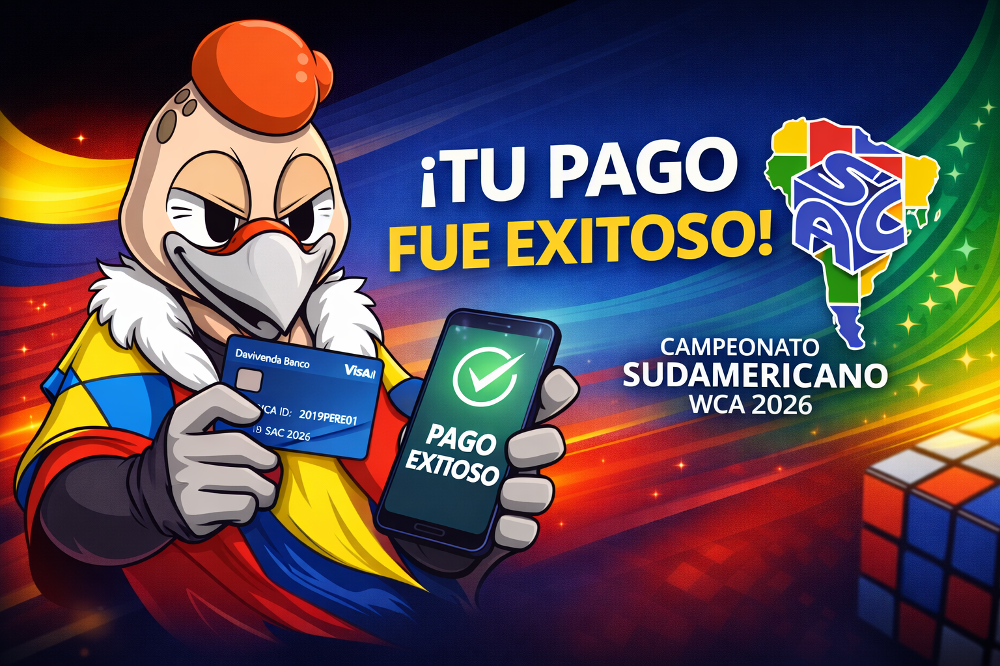

## 💳 Pagos e Inscripciones

En esta sección encontrarás toda la información necesaria para realizar el pago de la inscripción al  
**Campeonato Sudamericano WCA 2026 (SAC 2026)**.

---

### 💰 Valores

- **Inscripción competidores:** **COP $80.000**  
  *(≈ USD $20 – valor de referencia, sujeto a la tasa de cambio vigente)*

- **Entrada espectadores:** **COP $5.000 por persona por evento**  
  *(Pago presencial durante el evento, sujeto a disponibilidad)*

---

### 🏦 Información bancaria

Los pagos deben realizarse mediante transferencia bancaria a la siguiente cuenta:

- **Banco:** Davivienda  
- **Tipo de cuenta:** Ahorros  
- **Número de cuenta:** **0550108900738049**  
- **Nombre:** **CORPORACIÓN SPEEDCUBING COLOMBIA**

---

### 📧 Confirmación del pago (obligatoria)

Una vez realizado el pago, debes enviar un correo electrónico a:

**📩 staff@speedcubingcolombia.org**

**Asunto del correo (formato requerido):**

Juan Pérez + 2019PERE01 + SAC 2026

**En el cuerpo del correo debes incluir:**
- **Comprobante de pago**
- **Cualquier otro detalle que desees agregar**  
  *(por ejemplo: pago internacional, pago grupal, corrección de datos, etc.)*

⚠️ La inscripción solo será considerada válida una vez el pago haya sido verificado por el equipo organizador.

---

*Evento oficial World Cube Association*  
*Organiza: Speedcubing Colombia*

