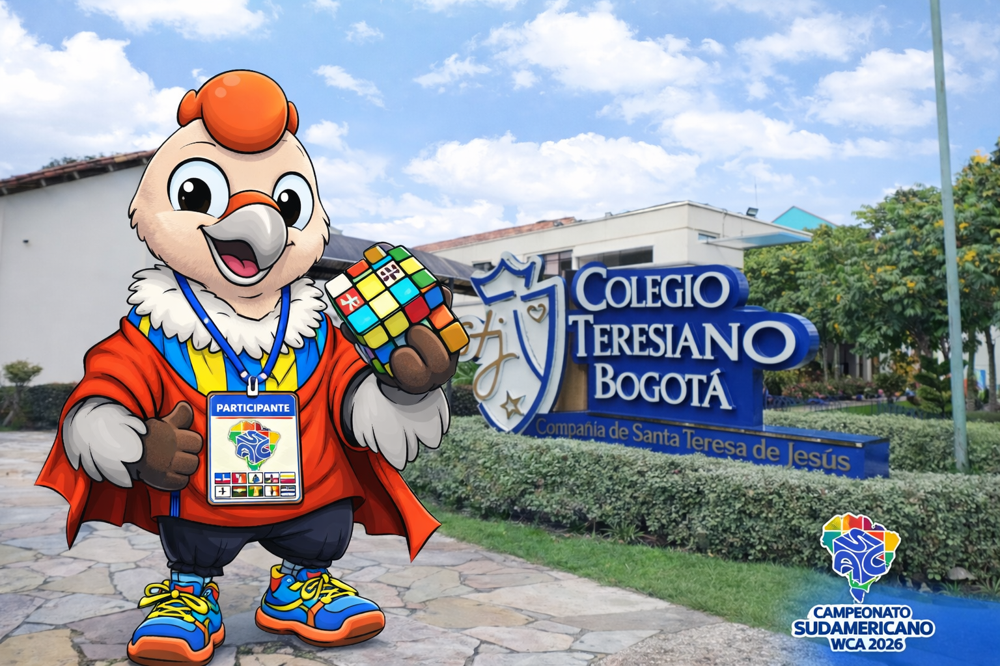

# 🏫 COLEGIO TERESIANO — BOGOTÁ, COLOMBIA

Sede oficial del  
** WCA South American Championship 2026 (SAC 2026)**

---

🇪🇸 Español

## Información de la sede

📍 **Dirección:** Calle 152 # 20-42, Usaquén, Bogotá D.C., Colombia  

🗺️ **Mapa del venue:**  
[Ver ubicación en Google Maps](https://www.google.com/maps/place/Colegio+Teresiano+Bogota,+Av.+19,+Usaqu%C3%A9n,+Bogot%C3%A1/@4.735131,-74.0489518,17.77z)

---

### 🚍 Cómo llegar

**Opción más económica — TransMilenio**
- Estación más cercana: **Mazurén**
- Valor del pasaje: **COP $3.200** (≈ **USD $0.80**)
- Desde la estación:
  - Taxi: 5 minutos  
  - Caminata: 15–20 minutos

**Desde el Aeropuerto Internacional El Dorado (BOG)**
- **Taxi / App de transporte**
  - Costo aproximado: **COP $60.000 – $80.000** (≈ **USD $15 – $20**)
  - Tiempo estimado: 45–90 minutos (según tráfico)

**Apps de transporte recomendadas**
- Uber: https://m.uber.com/ul/
- DiDi: https://web.didiglobal.com/
- inDrive: https://indrive.com/

⚠️ **Recomendación de seguridad:**  
Utiliza únicamente **taxis oficiales del aeropuerto** o aplicaciones de transporte. Evita taxis informales.

---

🇺🇸 US English

## Venue information

📍 **Address:** Calle 152 # 20-42, Usaquén, Bogotá D.C., Colombia  

🗺️ **Venue map:**  
[View location on Google Maps](https://www.google.com/maps/place/Colegio+Teresiano+Bogota,+Av.+19,+Usaqu%C3%A9n,+Bogot%C3%A1/@4.735131,-74.0489518,17.77z)

---

### 🚍 Getting there

**Most affordable option — TransMilenio**
- Nearest station: **Mazurén**
- Fare: **COP $3,200** (≈ **USD $0.80**)
- From the station:
  - Taxi: 5 minutes  
  - Walking: 15–20 minutes

**From El Dorado International Airport (BOG)**
- **Taxi / Ride-hailing app**
  - Estimated cost: **COP $60,000 – $80,000** (≈ **USD $15 – $20**)
  - Estimated time: 45–90 minutes (traffic dependent)

**Recommended ride-hailing apps**
- Uber: https://m.uber.com/ul/
- DiDi: https://web.didiglobal.com/
- inDrive: https://indrive.com/

⚠️ **Safety recommendation:**  
Use **official airport taxis** or ride-hailing apps only. Avoid informal taxis.

---

🇧🇷 Português

## Informações do local

📍 **Endereço:** Calle 152 # 20-42, Usaquén, Bogotá D.C., Colômbia  

🗺️ **Mapa do local:**  
[Ver localização no Google Maps](https://www.google.com/maps/place/Colegio+Teresiano+Bogota,+Av.+19,+Usaqu%C3%A9n,+Bogot%C3%A1/@4.735131,-74.0489518,17.77z)

---

### 🚍 Como chegar

**Opção mais econômica — TransMilenio**
- Estação mais próxima: **Mazurén**
- Tarifa: **COP $3.200** (≈ **USD $0.80**)
- A partir da estação:
  - Táxi: 5 minutos  
  - Caminhada: 15–20 minutos

**Do Aeroporto Internacional El Dorado (BOG)**
- **Táxi / Aplicativo**
  - Custo aproximado: **COP $60.000 – $80.000** (≈ **USD $15 – $20**)
  - Tempo estimado: 45–90 minutos (dependendo do trânsito)

**Aplicativos recomendados**
- Uber: https://m.uber.com/ul/
- DiDi: https://web.didiglobal.com/
- inDrive: https://indrive.com/

⚠️ **Recomendação de segurança:**  
Utilize apenas **táxis oficiais do aeroporto** ou aplicativos. Evite táxis informais.

---

_Evento oficial World Cube Association_  
_Organiza: Speedcubing Colombia_

---

_Evento oficial World Cube Association_  
_Organiza: Speedcubing Colombia_
